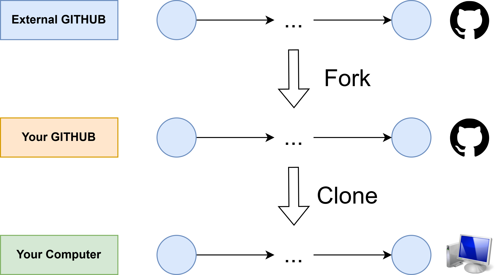
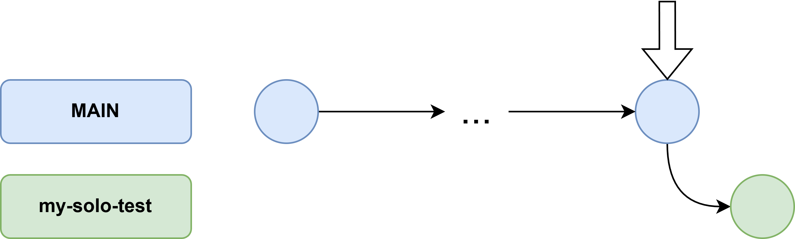
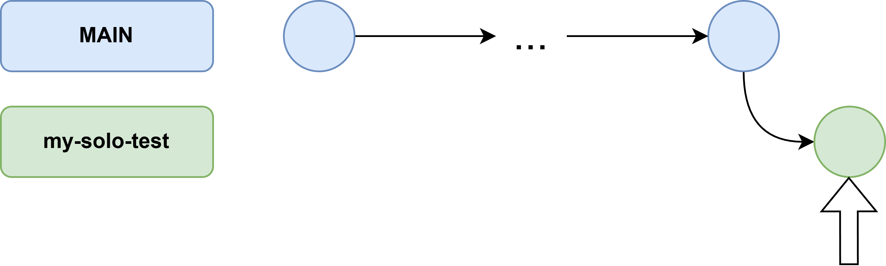
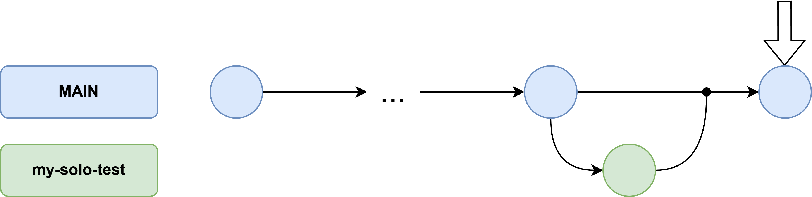
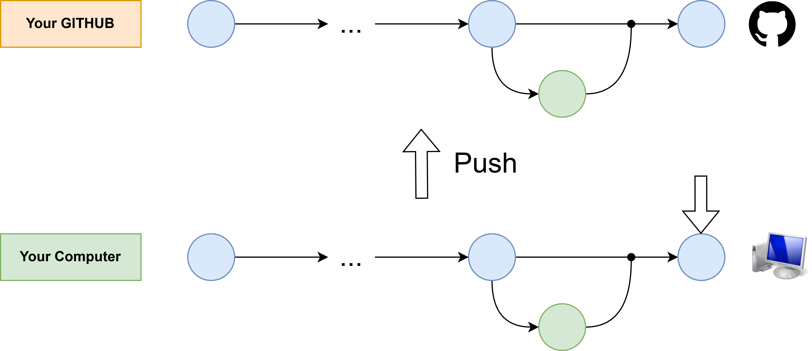

# Git & GitHub Terminal Lab

Welcome! The goal of today's session is to master the **Git Terminal** workflow. You will first learn how to manage your own project locally and then contribute to a shared repository via a Pull Request.

<p align="center">
  
</p>

---

## 0. Authentication: Setting up your Token
GitHub no longer accepts your account password for terminal operations. To upload your code, you must use a **Personal Access Token (PAT)**.

1.  **Generate Token:** Go to your GitHub [Settings](https://github.com/settings/profile) -> **Developer settings** -> **Personal access tokens** -> **Tokens (classic)**.
2.  **Configure:** Click **Generate new token (classic)**. Give it a name (e.g., "Lab Token").
3.  **Scopes:** Select the **'repo'** checkbox AND the **'workflow'** checkbox.
4.  **Save it:** Click **Generate token**. **Copy the code immediately** (you won't see it again).
5.  **Save credentials (Optional but recommended):** To avoid pasting the token every time you push, run this command in your terminal before starting:

```bash
git config --global credential.helper store
```

6.  **Usage:** The first time you push, the terminal will ask for your **Username** (type your GitHub name) and **Password** (paste the **Token**). Because of the command above, it will be saved for future use.

---

## Exercise 1: Individual Workflow (Local Merge)

In this exercise, you will practice how to work on your own project where you have full control and don't need to ask for permission to merge changes.

### 1. Fork the Project
Click the **"Fork"** button at the top right of this GitHub page. This creates a personal copy of the repository under your own GitHub account.

### 2. Clone
Once you have your own copy, clone it to your computer (replace `YOUR_USERNAME` with your actual GitHub username):

```bash
git clone https://github.com/YOUR_USERNAME/git-java-lab.git
```

```bash
cd git-java-lab
```

<p align="center">
  
</p>

### 3. Create a Working Branch
It is best practice to never work directly on `main`. Create a branch for a new feature:

```bash
git checkout -b my-solo-test
```

> **Note:** The command `git checkout -b my-solo-test` is a shortcut that does two things at once:
> 1. `git branch my-solo-test` (Creates the branch)
<p align="center">
  
</p>

> 2. `git checkout my-solo-test` (Switches/moves your terminal to that branch)
<p align="center">
  
</p>

### 4. Make a Change
Create a new file called `notes.txt` using the terminal or your preferred text editor.

### 5. Commit and Merge locally
Instead of using the GitHub website, you will merge the change yourself directly in the terminal:

```bash
git add .
```

> **Note on `git add .`**: The dot (`.`) tells Git to stage **all** changes and new files in the current folder. It is very fast but you should be careful not to add files you don't want (like temporary files).

```bash
git commit -m "Add personal notes file"
```

Move back to main to bring the changes there
```bash
git checkout main
```

Merge the solo branch into main
```bash
git merge my-solo-test
```

<p align="center">
  
</p>

### 6. Push to your Cloud
Now that your local `main` is updated, upload it to your GitHub profile:

```bash
git push origin main
```

<p align="center">
  
</p>

---

## Exercise 2: Collaborative Workflow (Pull Request)

Now, you will contribute to the **original** repository (the professor's project). Since you don't have direct "Push" access there, you must submit a **Pull Request (PR)**.

### 1. Create a Contribution Branch
Create a new branch named after yourself (e.g., `mikel-idoyaga`):

```bash
git checkout -b your-name-surname
```

<p align="center">
  
</p>

### 2. Edit the Code
Open `Participants.java` with any text editor and add your line inside the `main` method:
`greet("Your Name", "your-github-username");`

### 3. Stage and Commit
You must save your changes to the git history:

```bash
git add Participants.java
```
> **Note on `git add [filename]`**: Specifying the file name is the **safest** way to work. It ensures you only stage the exact file you intended to change, ignoring any other accidental modifications in the project.
```bash
git commit -m "Add [Your Name] to the participants list"
```

### 4. Push the Branch to GitHub
Upload your specific branch to your fork:

```bash
git push origin your-name-surname
```

### 5. Open the Pull Request
1. Go to **your fork** on the GitHub website.
2. Change the branch to the one you have already created.
3. Look for a notification bar that says **"Compare & pull request"** and click it.
4. Click the green **"Create pull request"** button.

<p align="center">
  
</p>

---

*Note: Wait for the ✅ or ❌ icon in your PR to see if your Java code passed the automated tests.*
